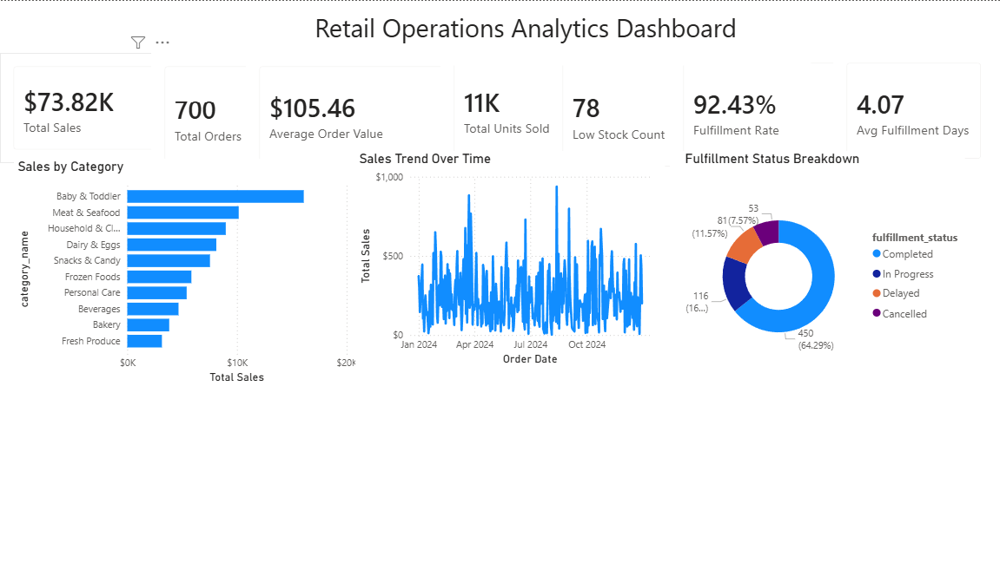
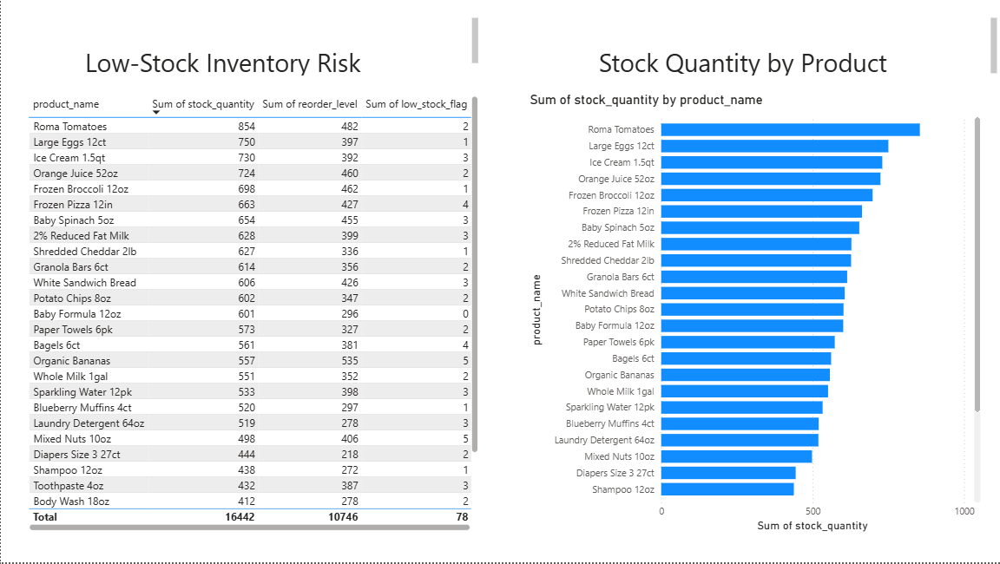

# 🛒 Retail Operations Analytics Dashboard

> **Tools:** MySQL · Power BI · Excel · Python · GitHub  
> **Domain:** Retail Operations · Supply Chain · MIS · Data Analytics  
> **Dataset:** 7 tables · 3,000+ records · 2024 simulated retail operations data

---

## 📌 Project Overview

This project is an end-to-end retail operations analytics dashboard that analyzes sales performance, inventory health, order fulfillment efficiency, and stockout risk across multiple store locations and regions.

The project was inspired by real-world retail operations experience, including online grocery pickup, inventory management, order fulfillment, routing, substitutions, and operational reporting. The goal was to build a realistic MIS/data analytics project that connects business operations with technical tools such as SQL, Power BI, and Excel.

---

## 🧩 Business Problem

Retail operations managers often need to make fast decisions using data from multiple areas of the business, including sales, inventory, fulfillment, stores, products, and suppliers.

Without a centralized dashboard, it can be difficult to answer questions such as:

- Which product categories generate the most sales?
- Which products are at risk of running low on inventory?
- Which stores or regions are performing best?
- What percentage of orders are fulfilled successfully?
- How long does fulfillment take on average?
- Which products require closer inventory monitoring?

This dashboard solves that problem by combining retail operations data into one reporting system with KPIs, charts, and inventory risk views.

---

## 👥 Who This Dashboard Is For

| Role | How They Use It |
|---|---|
| Store Operations Manager | Monitor sales, fulfillment rate, and low-stock items |
| Inventory / Supply Chain Analyst | Track reorder levels and identify stockout risks |
| Regional Manager | Compare sales performance across stores and regions |
| Business Analyst | Review KPIs and identify operational trends |
| MIS / IT Analyst | Support data organization, reporting, and dashboard development |

---

## 🗂️ Repository Structure

```text
retail-ops-dashboard/
│
├── README.md
│
├── data/
│   ├── generate_data.py
│   ├── categories.csv
│   ├── suppliers.csv
│   ├── stores.csv
│   ├── products.csv
│   ├── inventory.csv
│   ├── orders.csv
│   └── order_details.csv
│
├── sql/
│   ├── 01_create_schema.sql
│   ├── 02_load_data.sql
│   └── 03_analysis_queries.sql
│
├── powerbi/
│   ├── powerbi_guide.md
│   └── Retail_Operations_Dashboard.pbix
│
├── excel/
│   └── excel_guide.md
│
├── documentation/
│   ├── data_dictionary.md
│   ├── er_diagram.md
│   └── project_overview.md
│
└── screenshots/
    ├── powerbi_dashboard_overview.png
    └── inventory_risk_page.png
```

---

## 🗃️ Dataset Description

All data is simulated but modeled after realistic retail operations. The dataset was generated using Python and includes sales, product, store, supplier, inventory, and order fulfillment data.

| Table | Rows | Description |
|---|---:|---|
| categories | 10 | Product category groupings |
| suppliers | 10 | Supplier records and specialties |
| stores | 8 | Store and region records |
| products | 30 | Product SKUs with category, supplier, cost, and price |
| inventory | 240 | Store-level inventory, stock quantity, reorder level, and low-stock flag |
| orders | 700 | Order headers with date, store, fulfillment status, and delivery days |
| order_details | 2,059 | Order line items with product, quantity, unit price, and line total |
| **Total** | **3,057** | Combined simulated retail records |

### Key Columns

| Column | Table | Description |
|---|---|---|
| `order_id` | orders | Unique order identifier |
| `order_date` | orders | Date the order was placed |
| `fulfillment_status` | orders | Completed, In Progress, Delayed, or Cancelled |
| `delivery_days` | orders | Number of days from order placement to fulfillment |
| `product_id` | products / order_details / inventory | Unique product identifier |
| `product_name` | products | Product name |
| `quantity_ordered` | order_details | Quantity ordered by the customer |
| `unit_price` | order_details | Selling price per unit |
| `line_total` | order_details | Quantity ordered multiplied by unit price |
| `stock_quantity` | inventory | Current stock quantity at the store level |
| `reorder_level` | inventory | Inventory threshold that triggers reorder attention |
| `low_stock_flag` | inventory | 1 = at or below reorder level; 0 = adequate stock |
| `region` | stores | Geographic region of the store |

---

## 📊 Dashboard Screenshots

### Power BI Dashboard



### Inventory Risk Page



---

## 📈 Power BI Dashboard

The Power BI dashboard contains 2 pages.

| Page | Purpose | Key Visuals |
|---|---|---|
| Executive Summary | Provides a high-level overview of retail operations performance | KPI cards, sales trend line chart, sales by category chart, fulfillment status donut chart |
| Inventory Risk | Identifies products and stores with potential stockout risk | Low-stock inventory table, stock quantity by product chart |

### DAX Measures Built

- Total Sales
- Total Orders
- Average Order Value
- Total Units Sold
- Fulfillment Rate %
- Average Fulfillment Days
- Low Stock Count

### Dashboard KPIs

| KPI | Purpose |
|---|---|
| Total Sales | Measures overall revenue from order line items |
| Total Orders | Counts unique customer orders |
| Average Order Value | Shows average revenue per order |
| Total Units Sold | Tracks total quantity sold |
| Average Fulfillment Days | Measures average delivery/fulfillment time |
| Low Stock Count | Counts inventory items at or below reorder level |
| Fulfillment Rate | Measures the percentage of orders not cancelled |

---

## 📊 Excel Dashboard Plan

The Excel version is designed as a secondary reporting tool using:

- PivotTables
- PivotCharts
- Slicers
- KPI summary cards
- Conditional formatting for low-stock items

Recommended Excel visuals include:

- Sales by category
- Sales by region/store
- Fulfillment status breakdown
- Low-stock inventory table
- Top products by sales
- Monthly sales trend

---

## 🔍 SQL Analysis Queries

The SQL folder includes business queries for retail operations analysis.

Queries include:

1. Total sales by month
2. Sales by category
3. Sales by region and store
4. Top products by revenue
5. Low-stock products
6. Products below reorder level
7. Inventory summary by category
8. Order fulfillment status breakdown
9. Average fulfillment time by store
10. Supplier performance summary
11. Inventory turnover / inventory risk
12. Monthly fulfillment trend

---

## 💡 Sample Insights

Based on the simulated dataset:

- Total sales were approximately $73.8K across 700 orders.
- Average order value was approximately $105.46.
- The dashboard tracked over 11,000 units sold.
- Fulfillment rate was approximately 92%.
- Inventory risk analysis identified products at or below reorder level.
- Category-level sales helped show which product groups contributed most to revenue.

These insights demonstrate how retail data can be used to monitor store performance, fulfillment efficiency, and inventory risk.

---

## 🚀 How to Run This Project

### Step 1 — Review or Generate the Dataset

The CSV files are already included in the `data/` folder.

To regenerate the dataset, run:

```bash
cd data/
python generate_data.py
```

### Step 2 — Set Up the MySQL Database

Open MySQL Workbench and run:

```sql
source sql/01_create_schema.sql;
source sql/02_load_data.sql;
source sql/03_analysis_queries.sql;
```

The SQL scripts create the database structure, load the CSV files, and run business analysis queries.

### Step 3 — Open the Power BI Dashboard

Open the file:

```text
powerbi/Retail_Operations_Dashboard.pbix
```

The dashboard connects to the project data and includes an executive summary page and inventory risk page.

### Step 4 — Build or Review the Excel Dashboard

Open the Excel guide:

```text
excel/excel_guide.md
```

Use the CSV files to create PivotTables, PivotCharts, slicers, KPI cards, and conditional formatting.

---

## 🧠 Skills Demonstrated

- SQL database design
- Relational data modeling
- Primary and foreign key relationships
- SQL analysis queries
- Power BI dashboard development
- DAX measures
- Excel reporting
- Retail operations analytics
- Inventory risk analysis
- Business intelligence reporting
- MIS and decision-support systems

---

## 📄 Resume Bullet Points

### MIS / IT Roles

Designed a retail operations analytics system using MySQL, Power BI, and Excel, including 7 relational tables, primary/foreign key relationships, and dashboard KPIs for sales, inventory, fulfillment, and stockout risk analysis.

### Data Analyst Roles

Built an end-to-end retail analytics dashboard using SQL and Power BI to analyze 3,000+ simulated retail records across orders, products, stores, suppliers, and inventory; developed DAX measures for Total Sales, Average Order Value, Fulfillment Rate, and Low Stock Count.

### Business Analyst Roles

Translated retail operations requirements into a dashboard solution that monitors sales trends, order fulfillment, inventory risk, and product performance, helping support data-driven decisions for store and supply chain operations.

### Supply Chain / Operations Analyst Roles

Created an inventory and fulfillment analytics dashboard to identify low-stock products, compare stock quantity against reorder levels, and evaluate order fulfillment performance across retail store locations.

---

## 🔗 Connect

Built by Marcin Krol

---

*This project was built as a portfolio piece to demonstrate skills in database design, SQL querying, Power BI dashboard development, Excel reporting, and business analytics with a focus on retail operations and supply chain decision-making.*